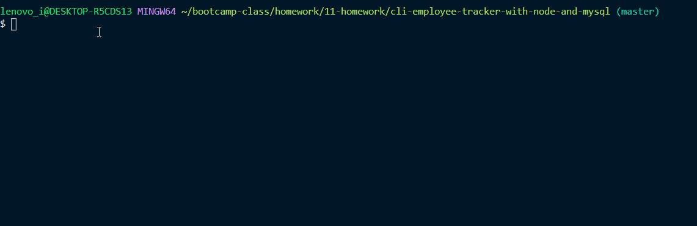

# CLI Employee Tracker with Node.js, mySQL, and Sequelize
A CLI using node.js, which uses mySQL as the database management system. This is my first time using a database or mySQL.

## Description 
Created a CLI using node.js for the functionality and mySQL for the database management system to complete a homework assignment in a full-stack web dev bootcamp. The object-relational mapping (orm) tool sequelize was used to interact with the database. This database was an employee tracker comprised of 3 tables. The CLI allows the user to view tables, add rows to tables, and update an employees role.

## Images
GIF demonstrating the Employee Tracker CLI in action.

## Installation 
Keep all files in a single folder and do not move files around within the folder. You must also have node.js and perform a npm install to bring in all the necessary node modules. Run application using sequelizeApp.js as your node starting point.

## Usage 
This was primarily made to meet the requirements of a homework assignment. If for some reason you really want to use a CLI to track your team of employees you could do that too.

## Credits 
I created this code based on the homework prompt created by Triology Education Services. Certain pieces of code I used online resources for help. I have included citations in the form of comments throughout the javascript.

## Contributing 
I was the only one to work on this project, but of course I had help from my instructor, TA's, and classmates.

## Challenges
Most of the challenges involved completing my first homework assignment that involved a database. There was a great deal of digging through the documentation for new npms related to dealing with the database and the database management system. At first we learned how to interact with the database using the npm mySQL. I created about 60% of the code to complete the assignment and the next day we learned Sequelize. I decided to rewrite my code using Sequelize and used async/await for the first time. 

## License
[MIT](https://choosealicense.com/licenses/mit/)